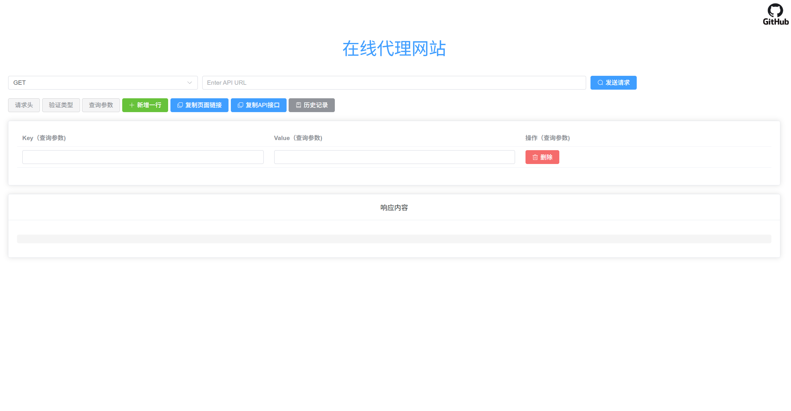

# 📦 ReverseProxy + Vue Request App

一个可视化可操作的前后端通用请求调试工具，可用于请求调试或者反向代理！

> 后端基于 Node.js 实现的反向代理
> 前端使用 Vue3 构建一个较为完整的 API 调试/构造界面

------

# 🧭 项目结构

```
/
├─ reverseProxy/          # Node.js 反向代理服务器
│  ├─ main.js             # 主代理逻辑
│  ├─ main.json           # 配置文件（端口、鉴权、黑名单等）
│  ├─ tools.js            # 工具函数（获取本机 IP ）
│  └─ webPro/             # （可选）静态页面文件，存放vue-request-app构建的静态页面文件
│
└─ vue-request-app/       # Vue3 前端应用
   ├─ src/
   │  ├─ components/
   │  │  ├─ History.vue        # 请求历史记录页面组件
   │  │  ├─ Index.vue          # 请求发送主界面
   │  │  ├─ RequestBody.vue    # 请求体构造组件（post/put/delete）
   │  │  └─ UserAuth.vue       # 用户身份认证界面组件
   │  └─ ...
   └─ package.json
```

------

# 🚀 1. ReverseProxy（Node.js）说明文档

## 🔥 特性概览

### ✔ 支持多种 Content-Type 自动识别

- `application/json`
- `text/plain`
- `application/x-www-form-urlencoded`
- `multipart/form-data`（支持文件上传）

### ✔ 自动过滤本机 IP（安全性更高）

### ✔ 配置热更新

修改 `main.json` 不用重启服务

### ✔ 支持 Basic Auth 访问限制

### ✔ 域名黑名单过滤

避免代理敏感/非法域名

### ✔ 会话保持（session）

自动记住最近使用的目标 URL（当请求路径为空时，会自动请求会话中最近一次请求的URL）

### ✔ 全局频率限制（rate-limit）

### ✔ CORS 全控制

允许前端跨域访问

------

## 🛠 安装依赖

在 `reverseProxy/` 目录执行：

```
npm install
```

------

## ⚙ 配置文件（main.json）

一个示例：

```
{
  "port": 8082,
  "timeout": 60000,
  "session": {
		"secret": "kfcfkxqsvw50",
		"name": "sessionName",
		"resave": false,
		"saveUninitialized": true,
		"cookie": {
			"maxAge": 86400000,
			"secure": false
		}
	},
  "accessOrigin": "*",
  "user": "admin",
  "pwd": "123456",
  "defaultSkip": "",
  "limiter": {
    "windowMs": 1000,
    "max": 3
  },
  "blacklist": ["google.com", "porn", "ip-api"]
}
```

字段说明：

| 字段         | 说明                                                         |
| ------------ | ------------------------------------------------------------ |
| port         | 监听端口                                                     |
| timeout      | 全局超时                                                     |
| accessOrigin | CORS 允许的 Origin                                           |
| user / pwd   | BasicAuth 鉴权                                               |
| blacklist    | 禁止代理的域名规则                                           |
| limiter      | 请求频率限制配置                                             |
| defaultSkip  | 默认跳转页面，其值格式为“/?url=要跳转链接的URL”              |
| session      | 跟会话相关的配置，secret为会话秘钥，name为会话名，maxAge为有效期 |

------

## ▶ 启动服务器

在 `reverseProxy/` 下：

```
node main.js
```

启动后你会看到：

```
Reverse Proxy running on port 8082
```

------

## 📡 使用方式

1、支持多种请求方法：GET/HEAD/POST/PUT/DELETE/OPTIONS/PATCH等

2、支持自定义参数，有url、headers和method

| 参数    | 说明                                                         |
| ------- | ------------------------------------------------------------ |
| url     | 其值为请求反代的目标URL（需包含http/https）                  |
| headers | 自定义反代请求头内容，其值的格式为“[{"请求头1","请求头1的值"},{"请求头2","请求头2的值"}]”（不设置则取前端部分请求头，自动删除authorization请求头） |
| method  | 自定义反代请求方法（不设置默认为前端请求方法）               |

```
请求示例：http://127.0.0.1:8082/?url=https://target.com&headers=[{"content-type":"application/json",{"authorization":"xxx"}]&method=get
```

------

# 🎨 2. Vue Request App

前端项目提供图形化的 API 调试页面，包含：

- 发送各种 HTTP 请求
- 构造请求头/请求体
- 文件上传
- 自定义用户身份验证
- 请求历史持久化

------

## 📁 目录结构（重要组件）

```
src/
├─ components/
│  ├─ Index.vue          # 主页面：输入 URL、方法、请求头、发送请求
│  ├─ RequestBody.vue    # 请求体构造器（json/键值对/文本/文件）
│  ├─ History.vue        # 请求历史记录
│  └─ UserAuth.vue       # 支持Basic Auth和Bearer Token
```

------

## 🎯 组件说明

### 1️⃣ `Index.vue` — 主请求页面

功能：

- 支持HTTP/HTTPS协议的目标 URL
- 支持多种请求方法 GET/POST/PUT/PATCH/DELETE
- 支持自定义请求头和构建请求体内容
- 支持调用reverseProxy.js部署的反代服务器发送请求
- 支持查看响应体（文本、图片、音视频、文件等）和响应头内容
- 自动将请求保存到历史记录

------

### 2️⃣ `RequestBody.vue` — 请求体构造页面

支持四种构造方式：

| 类型                | 用途            |
| ------------------- | --------------- |
| JSON                | 常见 API 请求体 |
| URLENCODED          | 表单提交        |
| Multipart（带文件） | 上传图片/文件   |
| 纯文本              | 自定义文本提交  |

------

### 3️⃣ `History.vue` — 请求历史展示页面

功能：

- 持久化存储本地（localStorage）
- 按照请求时间排序
- 可以对请求历史记录进行删除管理

------

### 4️⃣ `UserAuth.vue` — 代理身份认证

目前支持两种用户身份认证方式

- Basic Auth
- Bearer Token

在设置后所有请求都会将其带到 Authorization中。

------

## 🛠 安装与本地运行

在 `vue-request-app/` 下执行：

```
npm install
npm run serve
```

默认访问：

```
http://127.0.0.1:8080/web
```


